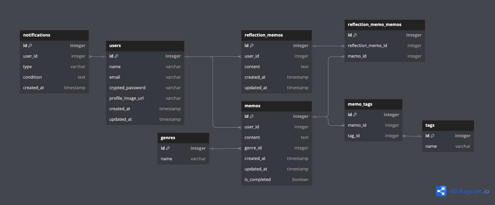

### 2024/06/29

### テーブルとカラムの説明
[ER図](https://dbdiagram.io/d/GraduationProject-667faad89939893dae957b43)

- usersテーブル （ユーザー情報を持つテーブル）
  - id : ユーザーID（主キー）
  - name : ユーザー名
  - email : メールアドレス
  - crypted_password : パスワード
  - profile_image_url : プロフィール画像のURL
  - created_at : 作成日時
  - updated_at : 更新日時

- memosテーブル （メモ情報を持つテーブル）
  - id : メモID（主キー）
  - user_id : ユーザーID（外部キー）
  - content : 内容
  - genre_id : ジャンルID（外部キー）
  - created_at : 作成日時
  - updated_at : 更新日時
  - is_completed : 完了フラグ

- genresテーブル （ジャンル(1対多)情報を持つテーブル）
  - id : ジャンルID（主キー）
  - name : ジャンル名

- tagsテーブル （タグ(多対多)情報を持つテーブル）
  - id : タグID（主キー）
  - name : タグ名

- memo_tagsテーブル （メモとタグ(多対多なので)の中間テーブル）
  - id : 関連ID（主キー）
  - memo_id : メモID（外部キー）
  - tag_id : タグID（外部キー）

- reflection_memosテーブル （振り返りメモ情報を持つテーブル）
  - id : 振り返りメモID（主キー）
  - user_id : ユーザーID（外部キー）
  - content : 内容
  - genres_id : ジャンルID（外部キー）
  - created_at : 作成日時
  - updated_at : 更新日時
  - is_completed : 完了フラグ

- reflection_memo_memosテーブル （振り返りメモとメモの関連テーブル）
  - id : 関連ID（主キー）
  - reflection_memo_id : 振り返りメモID（外部キー）
  - memo_id : メモID（外部キー）

- notificationsテーブル （通知情報を持つテーブル）
  - id : 通知ID（主キー）
  - user_id : ユーザーID（外部キー）
  - notification_type : 通知タイプ(定期のリマインド通知、不定期の質問形式通知)
  - condition : 通知条件
  - created_at : 作成日時

- テーブル間のリファレンス（外部キーの定義）
  - memos.user_id は users.id を参照
  - memos.genre_id は genres.id を参照
  - memo_tags.memo_id は memos.id を参照
  - memo_tags.tag_id は tags.id を参照
  - reflection_memos.user_id は users.id を参照
  - reflection_memo_memos.reflection_memo_id は reflection_memos.id を参照
  - reflection_memo_memos.memo_id は memos.id を参照
  - notifications.user_id は users.id を参照

### 2024/06/30
レビュー内容

>notifications
typeというカラム名は予約語になるので別の命名を考えた方が良さそうです
conditionsはどういう値が入る想定でしょうか？

- [x] type→notification_type
- [x] conditions→削除：notification_typeと内容が重複していたため

>reflection_memos
こちらmemosと分けた理由を伺いたいです（問題があるわけではなく単なる確認です！）

- 下記のように使い分けるために別テーブルを作成いたしました
  - メモ(memos)
    : 個々のメモを保存しそれぞれが独立関係
  - 振り返りメモ(reflection_memos)
    : １つ以上のmemosを関連付けて、新規メモを作成

### 2024/07/01
### ER図
https://i.gyazo.com/401acaef173909a4bceddf759ee4cbb6.png

### テーブル内容詳細
- usersテーブル （ユーザー情報を持つテーブル）
  - id : ユーザーID（主キー）
  - name : 名前
  - email : メールアドレス
  - crypted_password : パスワード
  - profile_image_url : プロフィール画像のURL
  - created_at : 作成日時
  - updated_at : 更新日時

- memosテーブル （メモ情報を持つテーブル）
  - id : メモID（主キー）
  - user_id : ユーザーID（外部キー）
  - content : 内容
  - genre_id : ジャンルID（外部キー）
  - created_at : 作成日時
  - updated_at : 更新日時
  - is_completed : 完了フラグ（デフォルトはfalse）

- genresテーブル （ジャンル(1対多)情報を持つテーブル）
  - id : ジャンルID（主キー）
  - name : ジャンル名

- tagsテーブル （タグ(多対多)情報を持つテーブル）
  - id : タグID（主キー）
  - name : タグ名

- memo_tagsテーブル （メモとタグ(多対多なので)の中間テーブル）
  - id : 関連ID（主キー）
  - memo_id : メモID（外部キー）
  - tag_id : タグID（外部キー）

- reflection_memosテーブル （振り返りメモ情報を持つテーブル）
  - id : 振り返りメモID（主キー）
  - user_id : ユーザーID（外部キー）
  - content : 内容
  - created_at : 作成日時
  - updated_at : 更新日時
  - is_completed : 完了フラグ（デフォルトはfalse）

- reflection_memo_memosテーブル （振り返りメモとメモの関連テーブル）
  - id : 関連ID（主キー）
  - reflection_memo_id : 振り返りメモID（外部キー）
  - memo_id : メモID（外部キー）

- notificationsテーブル （通知情報を持つテーブル）
  - id : 通知ID（主キー）
  - user_id : ユーザーID（外部キー）
  - notification_type : 通知タイプ(定期のリマインド通知、不定期の質問形式通知)
  - created_at : 作成日時

- テーブル間のリファレンス（外部キーの定義）
  - memos.user_id は users.id を参照
  - memos.genre_id は genres.id を参照
  - memo_tags.memo_id は memos.id を参照
  - memo_tags.tag_id は tags.id を参照
  - reflection_memos.user_id は users.id を参照
  - reflection_memo_memos.reflection_memo_id は reflection_memos.id を参照
  - reflection_memo_memos.memo_id は memos.id を参照
  - notifications.user_id は users.id を参照
